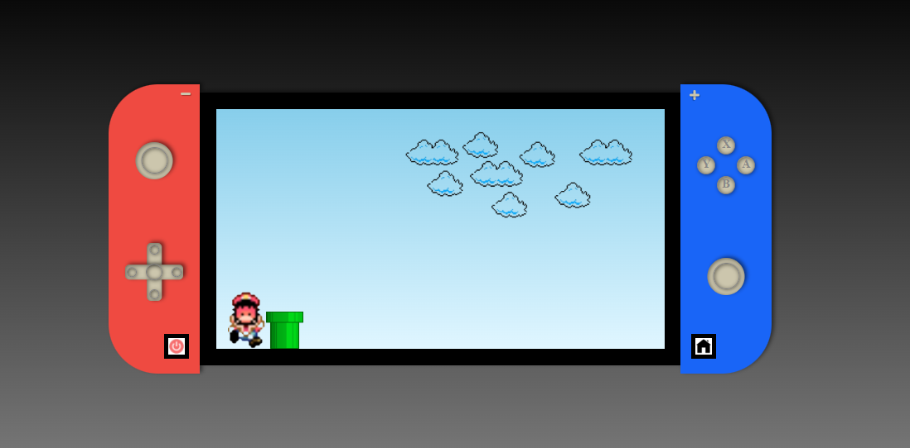

# Nintendo Switch

## Descrição
Este projeto começou com uma tentativa de desenhar um Nintendo Switch com CSS puro.
A inspiração para tal veio do vídeo [NINTENDO SWITCH - CSS3](https://www.youtube.com/watch?v=6oRr-fvv5z4).
Porém, conforme eu fui terminando o desenho, eu acabei decidindo colocar algumas animações com JavaScript e, ao finalizar algumas,
coloquei um pequeno jogo do mário que vi pela primeira vez há alguns anos no vídeo [Como criar um jogo SIMPLES usando JavaScript e HTML | JavaScript para iniciantes - Tutorial](https://www.youtube.com/watch?v=r9buAwVBDhA).
Assim, surgiu este meu pequeno projeto para quem quiser tentar se divertir.

## Contato
1. [Linkedin](https://www.linkedin.com/in/matheuspereiradevfront/)

## Como acessar
1. [Vercel](nintendo-switche-f01dygg7r-mathgpereira.vercel.app)